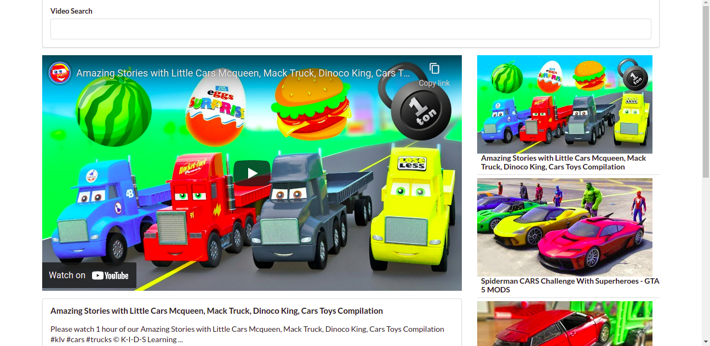

# PICS GENERATOR

- Simple project build with react and external youtube API. This app is basically similar to youtube which allows you to search and choose the videos you want to play. The main reason for doing this app was to show my understanding of react basic skills on how to work with function/classes/external api/ passing props and callbacks from child to parent

## Live server
<button> <a href="https://adoring-aryabhata-620a43.netlify.app/"> Live demo!</a> </button>

## Built With 

- Javacript
- React
- NPM
- AXIOS
- ASYNC & AWAIT

## Install 

> In order to install this project please follow the next steps:

1. - [ ] Open the `Terminal`
2. - [ ] Navigate to the directory where you want to add this repository
3. - [ ] Run git clone and `git@github.com:GzimAsani/React-Video-App.git` or with HTTP`https://github.com/GzimAsani/React-Video-App.git` 
5. - [ ] `cd` in the clonet repo and run `npm install`
6. - [ ] run `npm start` to start the project

## Author

👤 **Gzim Asani**
- Github: [@GzimAsani](https://github.com/GzimAsani)
- Linkedin: [GzimAsani](https://www.linkedin.com/in/gzim-asani-83390a17a/)

## 🤝 Contributing

Contributions, issues and feature requests are welcome!

Feel free to check the [issues page](https://github.com/GzimAsani/React-Video-App/issues).

## Show your support

Give a ⭐️ if you like this project!